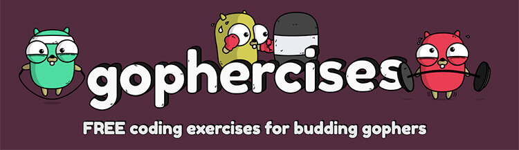

# quizGame
A simple quiz built with Go that is run using the command line.

The goal of the project is to get myself acquainted with Golang.

The task was taken from the ```Gophercises``` course by ```Jon Calhoun```



## **Project Details**

A program that reads the result of a test provided using a CSV file (more details below), and then provides the test to the user, tracking how many questions the user answered correctly and incorrectly. Regardless of whether the answer is correct or incorrect, the next question follows immediately after that.

The CSV file by default has the value test1.csv (an example is shown below), but the user has the option to configure the file name using the flag (an example is shown below).

The CSV file will be in the format as shown below, where the first column is a question, and the second column in the same row is the answer to this question.

```
5+5,10
"what 2+2, sir?",4
5+2,7
1+2,3
8+6,14
3+1,4
1+4,5
5+1,6
2+3,5
3+3,6
2+4,6
```

At the end of the quiz, the program shows the total number of correct questions and how many questions there were in total. Questions that are answered incorrectly are considered incorrect.

### ```Level 2```

A timer has been added to this level. The default time limit is 30 seconds, but it is also possible to configure it using the flag.

The quiz ends as soon as the allotted time expires. That is, the program does not wait for the user to answer one last question.

# Install

1. Installing Go on your system: ```Linux``` | ```Windows```

2. Once Go is successfully installed, type in the following command: 
```git
    git clone github.com/Almas016/quizGame.git
    cd quizGame
```

3. Type  
```go
   go run cmd/main.go
```

4. From the moment, the quiz shall start automatically on the terminal itself.

# Additional features

You can choose the difficulty of the quiz, for this, after the launch command, you need to specify the level in the flag, an example will be given below. The default level is 1.
```go
    go run cmd/main.go -level=2
```

You can also specify a csv file for the exam

```go
    go run cmd/main.go -fn=test2
```

In addition, you can also specify the time for the exam, but this option is only available for level 2. The default time is 30 seconds, after which the quiz ends.

```go
    go run cmd/main.go -time=60
```